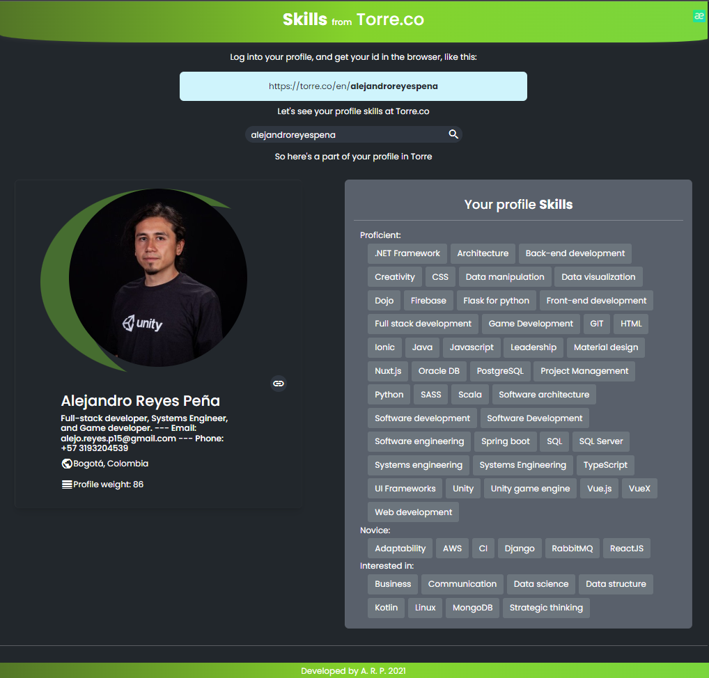
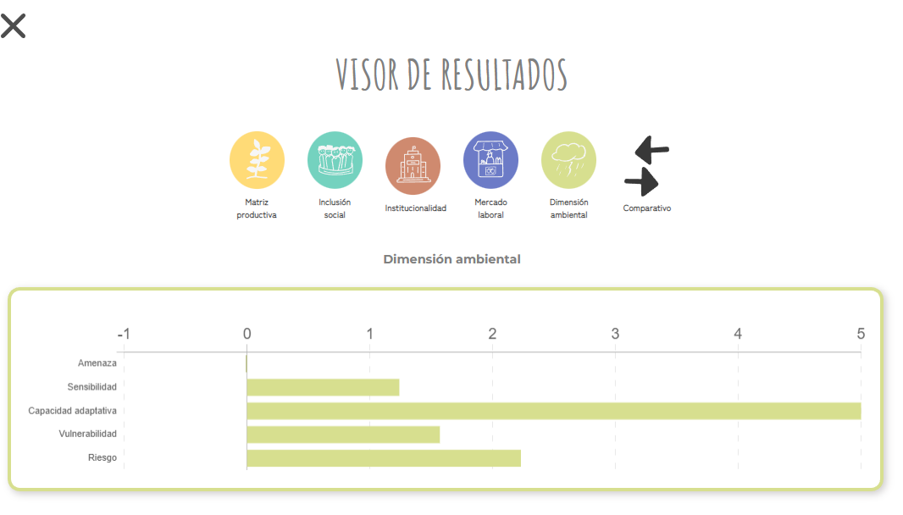
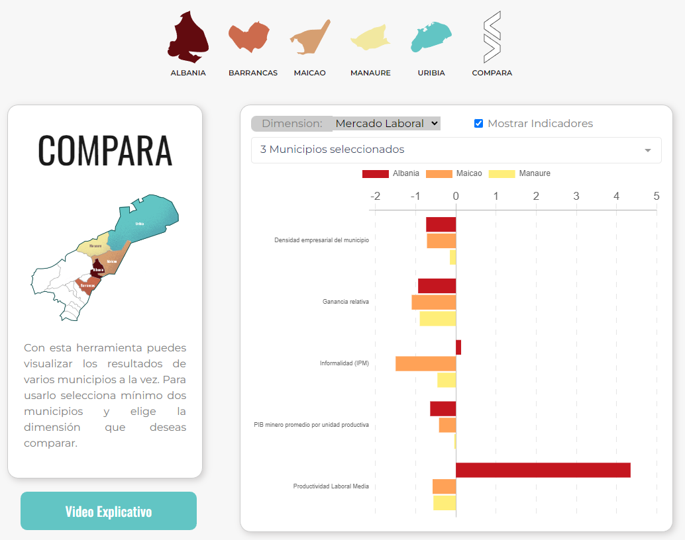

# Projects
Some projects to be shown being part of web development

# Torre Skills

### Front-end: [Torre Skills](https://torretechfront.herokuapp.com/) - [Github](https://github.com/travs15/FrontTorreApp)
 - This responsive app shows a little glimpse of the data about the user that's in the Torre plattform
#### *Javascript, Vue.js*

### Back-end: [Back Torre Skills](https://torretechback.herokuapp.com/technicalback/api/person/alejandroreyespena) - [Github](https://github.com/travs15/BackTorreApp)
 - There's no main page in the back end app but the way to try to an end point is:
 - Get user info: https://torretechback.herokuapp.com/technicalback/api/person/alejandroreyespena
 - Get skill info: https://torretechback.herokuapp.com/technicalback/api/person/alejandroreyespena/ANa01exy

#### *Java, Spring-boot*

# Data dashboard Puerto Asis

### Front-end: [Dashboard Puerto Asis](https://travs15.github.io/VisorDatosPuertoAsis/) - [Github](https://github.com/travs15/VisorDatosPuertoAsis)
- Dashboard of social indicators from Puerto Asis - Colombia
#### *Javascript, Vue.js*

# Data dashboard

### Front-end: [Dashboard Municipios](https://travs15.github.io/Visor_Datos_Municipios/) - [Github](https://github.com/travs15/Visor_Datos_Municipios)
- Dashboard of social indicators from different locations in Colombia
#### *Javascript, Vue.js*